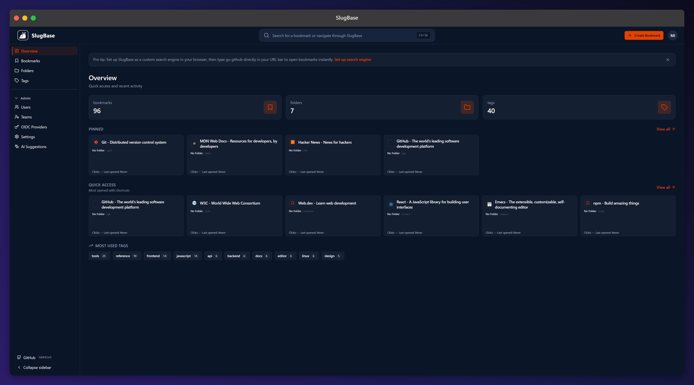

# Welcome to SlugBase

**Your links. Your structure. Your language. Your rules.**

SlugBase is an open-source, self-hosted bookmark manager with optional link forwarding. Store and organize your bookmarks, and optionally expose them as personal short redirect URLs.

## 🚀 Try the Demo

Experience SlugBase live at **[https://slugbase-demo.ghotso.dev](https://slugbase-demo.ghotso.dev)**

**Demo Credentials:**
- **Admin**: `admin@demo.slugbase` / `DemoAdmin123!`
- **Alice**: `alice@demo.slugbase` / `DemoUser123!`
- **Bob**: `bob@demo.slugbase` / `DemoUser123!`

> 💡 **Note:** The demo database resets hourly. For more details, see the [Demo Guide](demo).

## What is SlugBase?

SlugBase is a powerful bookmark management system that gives you complete control over how you organize and access your links. Whether you're managing personal bookmarks or sharing resources with teams, SlugBase provides a flexible, privacy-focused solution.

## Key Features

### 📚 Bookmark Management
Store and organize your bookmarks with titles, URLs, and optional custom slugs. Create a personal knowledge base of your favorite links.

### 🏷️ Organization Tools
Organize bookmarks using:
- **Folders** - Group related bookmarks together
- **Tags** - Flexible labeling system with many-to-many relationships
- **Filters** - Quickly find bookmarks by folder, tag, or combinations
- **Sorting** - Sort by date, alphabetically, usage, or access time
- **Global Search** - Press `Ctrl+K` to search across bookmarks, folders, and tags
- **View Modes** - Card view or compact list view with density controls
- **Bulk Actions** - Select multiple bookmarks for batch operations

### 🔗 Link Forwarding (Optional)
Expose your bookmarks as short redirect URLs using the format `/{user_key}/{slug}`. Perfect for creating memorable, shareable links.

### 👥 Sharing & Collaboration
Share bookmarks and folders with:
- **Teams** - Share with multiple users at once
- **Individual Users** - Direct sharing for specific people
- **Dedicated Shared View** - Access all shared content in one place

### 🔐 Authentication Options
- **OIDC Providers** - Login with GitHub, Google Workspace, or other OIDC-compliant providers
- **Local Authentication** - Email/password as a fallback option
- **Admin System** - Full user and team management

### 🌐 Internationalization
Full i18n support with multiple languages (English, German, French) and easy extension for more languages.

### 🌓 Dark/Light Mode
Automatic theme detection from your browser preferences, with manual toggle and theme persistence.

## Getting Started

1. **[Try the Demo](demo)** - Experience SlugBase live with pre-configured data
2. **[Setup](setup)** - Initial configuration and creating your first admin user
3. **[Dashboard](dashboard)** - Overview of your bookmarks and quick navigation
4. **[Bookmarks](bookmarks)** - Managing your bookmark collection
5. **[Folders](folders) & [Tags](tags)** - Organizing your bookmarks
6. **[Shared](shared)** - Accessing shared content

## Documentation Sections

### Core Features
- [Setup Page](setup) - Initial system configuration
- [Dashboard](dashboard) - Main landing page and analytics
- [Bookmarks](bookmarks) - Bookmark management
- [Folders](folders) - Folder organization
- [Tags](tags) - Tag management
- [Shared](shared) - Shared content access

### User Features
- [Profile](profile) - Account settings and preferences
- [Login](login) - Authentication options
- [Password Reset](password-reset) - Password recovery
- [Search Engine Guide](search-engine-guide) - Browser search integration

### Administration
- [Admin Page](admin) - User, team, and system management
- [OIDC Setup](oidc-setup) - Configuring OIDC providers

## Technology

SlugBase is built with modern web technologies:
- **Frontend**: React 18+ with TypeScript, Tailwind CSS, Vite
- **Backend**: Node.js with Express, TypeScript, Passport.js
- **Database**: SQLite (default) or PostgreSQL
- **Deployment**: Docker-ready with multi-stage builds

## Self-Hosted & Privacy-Focused

SlugBase is designed to be self-hosted, giving you:
- Complete control over your data
- No reliance on third-party services
- Privacy-focused design
- Full customization capabilities

---

Ready to get started? Begin with the [Setup Page](setup) to configure your SlugBase instance.
