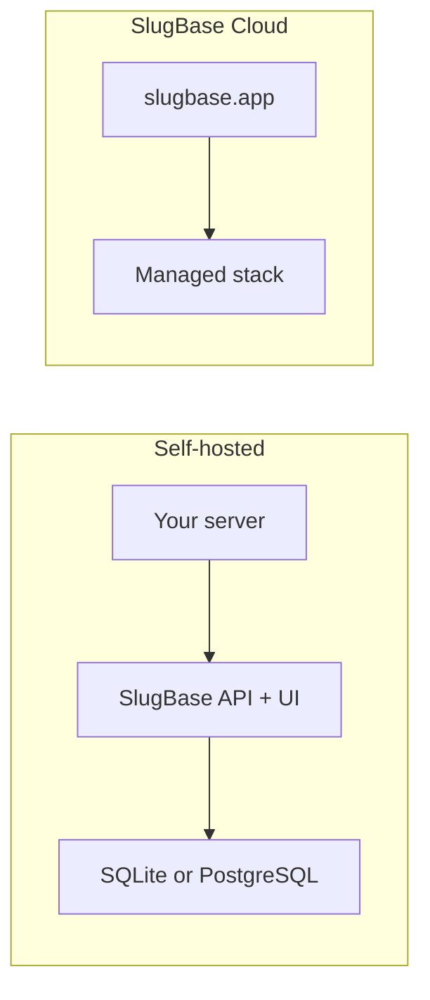

## What you get with self-hosted SlugBase

Self-hosted SlugBase is an open-source bookmark manager you run on your own infrastructure. You save and organize bookmarks (title, URL, optional folders and tags), search from anywhere with **Search (Ctrl+K)**, and optionally turn bookmarks into short links served at `/go/<slug>` for sharing and browser shortcuts.

The first account you create during initial setup is an administrator. From **Admin** in the app you can manage members, teams, **OIDC Providers**, **Settings** (including SMTP), and **AI Suggestions** when you want OpenAI-powered title, tag, and slug hints while creating bookmarks.

<Callout kind="info">
  **Cloud vs self-hosted:** The hosted product at [slugbase.app](https://slugbase.app) adds organizations, plans, and billing on top of the same core app. Feature behavior that is the same in both editions is documented in these self-hosted guides unless a [Cloud guide](/cloud/introduction) says otherwise.
</Callout>

## Main areas of the app

After setup and login, the app is organized around routes such as the dashboard (`/`), **Bookmarks** (`/bookmarks`), **Folders** (`/folders`), **Tags** (`/tags`), and **Profile** (`/profile`). Slug forwarding uses `/go/<slug>`; **Go preferences** lives under `/go-preferences`, and the in-app browser search-engine guide is at `/search-engine-guide`. Workspace administration is under `/admin` (tabs include **Members**, **Teams**, **OIDC Providers**, **Settings**, and **AI Suggestions**).

## Terminology

| Term | Meaning |
| --- | --- |
| **Bookmark** | A saved URL with metadata; a slug is optional. |
| **Slug** | A short keyword that resolves to a bookmark URL via `/go/...` and browser shortcuts. |
| **Self-hosted** | The core product you install and run yourself (open-source license in the [SlugBase repository](https://github.com/mdg-labs/slugbase)). |
| **Cloud** | The hosted multi-tenant service; app URLs are under `https://slugbase.app/app/...`. |

## Where to go next

<Columns cols="2">
  <Card title="Quick start" href="/selfhosted/quick-start" icon="zap">
    Run SlugBase locally for development or try a fast production path.
  </Card>
  <Card title="Docker Compose" href="/selfhosted/docker-compose" icon="layers">
    Recommended way to run the full app in production with persistent data.
  </Card>
  <Card title="Configuration" href="/selfhosted/configuration" icon="settings">
    Environment variables, secrets, and URLs that must match your deployment.
  </Card>
  <Card title="First run setup" href="/selfhosted/first-run-setup" icon="rocket">
    Create the first admin user and reach the dashboard.
  </Card>
</Columns>

## How these guides are structured

Guides follow a few repeatable shapes so you can scan quickly and follow procedures safely.

| Template | When we use it | Typical sections |
| --- | --- | --- |
| **A — Install / configure** | Deployment and env topics | What you need → **Steps** → Verify → Troubleshooting |
| **B — Feature guide** | Using a product area | What it is for → Before you start → **Steps** for the main flow → Related links |
| **C — Concept + task** | Ideas like slugs or sharing | Short concept (tables where useful) → **Steps** to configure → Optional FAQ-style expandables |
| **D — FAQ / help** | Many short answers | Category headings or expandables; links into deeper guides |

## Writing standards in this documentation

- **Task-first headings** — Sections focus on what you will accomplish.
- **Second person, active voice** — Instructions address you directly.
- **Progressive disclosure** — Short overview, then prerequisites, then **Steps**, then troubleshooting when it helps.
- **UI labels** — Bold names match the English in-app strings so what you read here matches what you see in the product.

## Documentation.AI components we use

| Situation | Component |
| --- | --- |
| Ordered procedures (install, first run, click-paths) | **`<Steps>`** with **`<Step title="..." icon="...">`** |
| Notes, tips, warnings, success, danger | **`<Callout kind="info \| tip \| alert \| success \| danger">`** |
| Long optional detail or FAQ | **`<ExpandableGroup>`** / **`<Expandable title="..." default-open="false">`** |
| Alternatives (for example HTTP vs HTTPS proxy notes) | **`<Tabs>`** / **`<Tab title="..." icon="...">`** |
| Multiple equivalent snippets (for example `docker run` vs Compose) | **`<CodeGroup tabs="..." show-lines="true">`** |
| Hub / “where next” sections | **`<Columns cols="2">`** with **`<Card title="..." href="/…" icon="...">`** |

API reference pages (when wired to OpenAPI) use different components reserved for request/response documentation; these guide pages stick to the components above.
